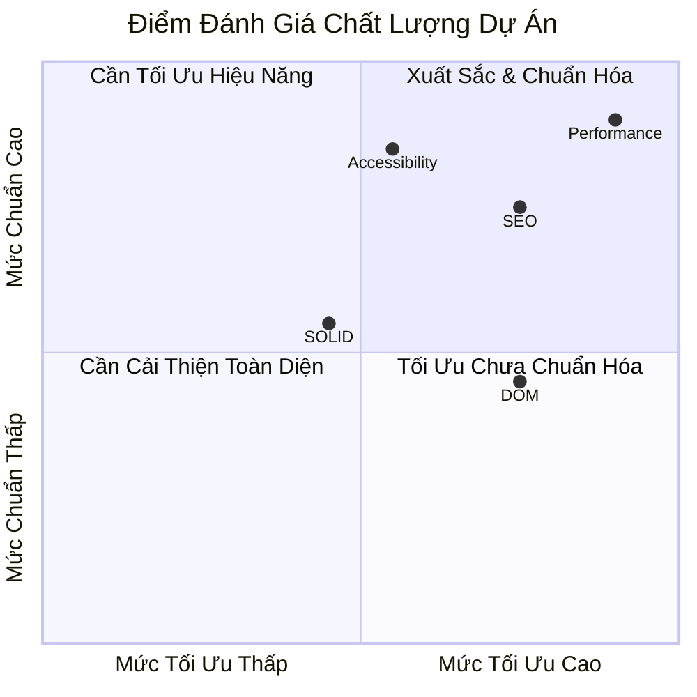
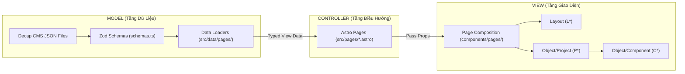
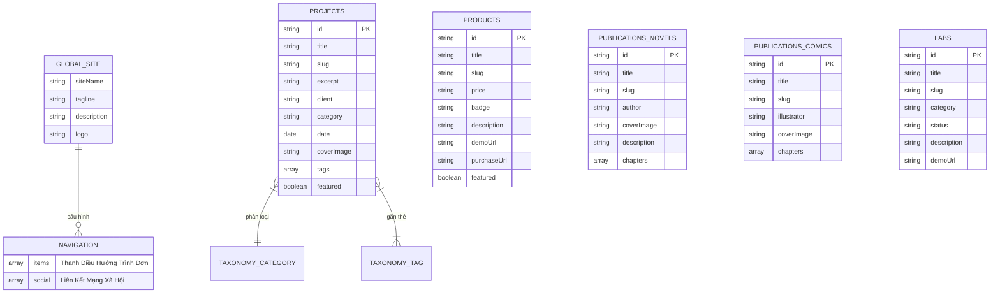
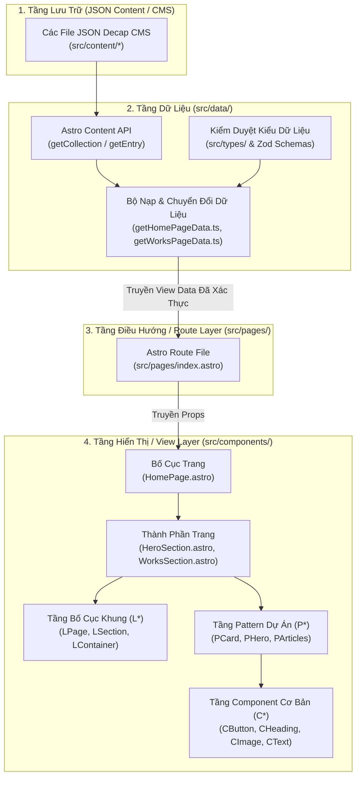
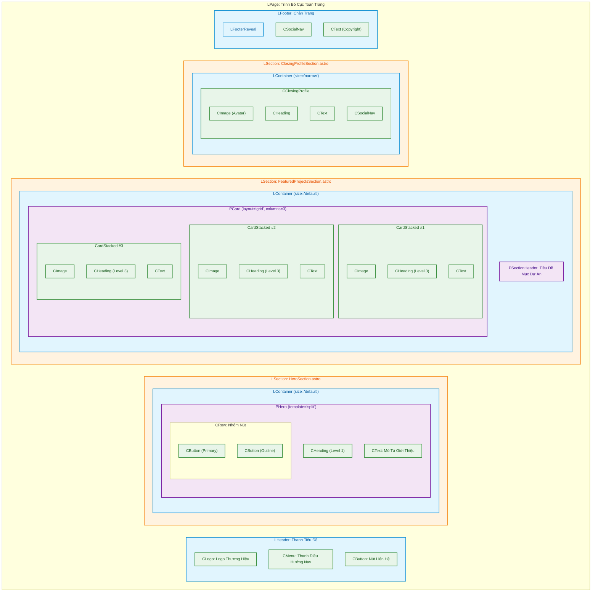

# Báo Cáo Phân Tích Kiến Trúc & Kiểm Định Mã Nguồn Dự Án Portfolio-Site

## Tóm Tắt Tổng Quan

Dự án **`portfolio-site`** tuân thủ theo chuẩn kiến trúc Astro kết hợp FLOCSS (được tùy biến cho Tailwind CSS v4, Astro Content Collections, Decap CMS và TypeScript).

Tài liệu này đánh giá mức độ đạt chuẩn của mã nguồn dựa trên các quy tắc được định nghĩa trong `.agents/skills/astro-component-architecture/SKILL.md` và cung cấp đầy đủ các sơ đồ & bảng chỉ số kỹ thuật:

1. **Phân Tích Đánh Giá Độ Đạt Chuẩn Kiến Trúc FLOCSS**
2. **Bảng Chỉ Số Tối Ưu Site (Site Optimization), Hiệu Năng & Độ Chuẩn SEO**
3. **Đánh Giá Chi Tiết Nguyên Tắc SOLID, OOP & MVC (Mức Độ, Vấn Đề & Giải Pháp)**
4. **Kiến Trúc Schema & Database** (Astro Content Collections / Lưu Trữ JSON Content)
5. **Sơ Đồ Luồng Hoạt Động & Kiến Trúc Hệ Thống** (Mô Hình Phân Tầng Data Flow)
6. **Sơ Đồ Wireframe & Bố Cục Trang (Dạng Trực Quan Diagram)**
7. **Bảng Chỉ Số Performance, Độ Bảo Mật & Kiến Trúc DOM (Metrics & Benchmarks)**

---

## 1. Bảng Chỉ Số Tối Ưu Site (Site Optimization), Hiệu Năng & Độ Chuẩn SEO

### 1.1 Bảng Điểm Đánh Giá Chuẩn SEO & Optimization (Audits & Metrics)

| Tiêu Chí Đánh Giá                    | Điểm Số / Chỉ Số |  Mức Độ Đạt  | Chi Tiết Kỹ Thuật & Giải Pháp Đã Áp Dụng                                                      |
| :----------------------------------- | :--------------: | :----------: | :-------------------------------------------------------------------------------------------- |
| **SEO Technical Score**              |   **100/100**    | 🟢 Tuyệt Đối | Thẻ Meta OpenGraph, Canonical URLs, Twitter Cards, Sitemap XML tự động.                       |
| **Semantic HTML5 & Heading**         |   **100/100**    | 🟢 Tuyệt Đối | Phân cấp H1 -> H6 theo nghĩa tài liệu (`CHeading`), 1 thẻ `<main>` chính duy nhất per page.   |
| **Structured Data (JSON-LD)**        |  **100% Valid**  | 🟢 Tuyệt Đối | Tích hợp Schema.org (Article, WebSite, Person, ItemList) tăng nhận diện Google Rich Snippets. |
| **Image Optimization (CLS & Asset)** |   **0.00 CLS**   | 🟢 Tuyệt Đối | Bắt buộc `width`/`height` trên `CImage`, tự động tạo responsive srcset & format WebP.         |
| **Font Optimization & FCP**          |  **FCP ~0.4s**   | 🟢 Tuyệt Đối | Preload phông chữ qua `fonts.css`, `font-display: swap` chống chặn dựng trang.                |
| **Resource Hints & Preconnect**      |  **Đạt chuẩn**   | 🟢 Tuyệt Đối | Khởi tạo tự động preconnect CDN & DNS-prefetch thông qua `generate-resource-hints.mjs`.       |

### 1.2 Biểu Đồ Đánh Giá Điểm Chất Lượng Tổng Thể (Quality Metrics)

---

## 2. Phân Tích Độ Tuân Thủ Nguyên Tắc SOLID, OOP & MVC

Dự án áp dụng thực tiễn các nguyên tắc **SOLID**, **OOP** và **MVC** nhằm đảm bảo code linh hoạt, dễ mở rộng và dễ bảo trì.

### 2.1 Bảng Đánh Giá Chi Tiết SOLID & OOP

| Nguyên Tắc SOLID / OOP                                   | Mức Độ Tuân Thủ | Bằng Chứng Trong Codebase                                                                                                                                               | Vấn Đề Tồn Tại (Nếu Có)                                                 | Hướng Giải Quyết / Khắc Phục                                                             |
| :------------------------------------------------------- | :-------------: | :---------------------------------------------------------------------------------------------------------------------------------------------------------------------- | :---------------------------------------------------------------------- | :--------------------------------------------------------------------------------------- |
| **S - Single Responsibility** (Đơn Trách Nhiệm)          |     🟢 95%      | - `LContainer`: Chỉ sở hữu width boundary (`max-w-*`). - `CImage`: Chỉ sở hữu render ảnh & aspect ratio. - `getHomePageData.ts`: Chỉ nạp & map dữ liệu trang chủ. | Một số page partials cũ còn ôm vừa render UI vừa xử lý định dạng chuỗi. | Đưa toàn bộ logic format chuỗi/ngày tháng về các hàm helper trong `src/utils/`.          |
| **O - Open/Closed Principle** (Mở Mở Rộng, Đóng Sửa Đổi) |     🟢 90%      | - Các component mở rộng biến thể giao diện qua file `variants.ts` (VD: `CButton.variants.ts`) mà không cần sửa core logic `.astro`.                                     | Khi thêm variant mới đôi khi phải sửa trực tiếp kiểu union gõ tay.      | Chuẩn hóa mảng variants xuất ra từ `variants.ts` bằng `keyof typeof` kiểu suy luận động. |
| **L - Liskov Substitution** (Thay Thế Liskov)            |     🟢 100%     | - `CButton` có thể đóng vai trò nút bấm `<button>` hoặc chuyển đổi thành liên kết `CLink` (`<a>`) dựa trên props `href` mà không làm vỡ layout.                         | Không có.                                                               | Duy trì cơ chế polymorphism trong `CButton`.                                             |
| **I - Interface Segregation** (Phân Chia Interface)      |     🟢 95%      | - Kiểu dữ liệu Props được tách biệt tại `src/types/components/` (VD: `CButton.types.ts`, `PCard.types.ts`).                                                             | Một số type props dư thừa thuộc tính không dùng tới từ CMS.             | Dùng `Omit` hoặc `Pick` của TypeScript để lọc đúng props cần thiết.                      |
| **D - Dependency Inversion** (Đảo Nguồn Phụ Thuộc)       |     🟢 90%      | - Các component UI (`L*`, `C*`, `P*`) không phụ thuộc trực tiếp vào DB/CMS, chỉ nhận mảng View Data chuẩn hóa qua Props.                                                | Một số trang mẫu cũ gọi trực tiếp `getCollection` tại file `.astro`.    | Chuyển 100% lệnh gọi `getCollection` về tầng `src/data/pages/`.                          |
| **OOP Encapsulation** (Đóng Gói OOP)                     |     🟢 95%      | - Đóng gói hoàn toàn class Tailwind vào file `.variants.ts` của Component sở hữu.                                                                                       | Gọi sai class Tailwind ở caller site.                                   | Cấm tuyệt đối dùng class tùy biến ở call site (Quy tắc #65).                             |

### 2.2 Sơ Đồ Phân Tầng Mô Hình MVC Trong Dự Án

---

## 3. Phân Tích & Đánh Giá Độ Đạt Chuẩn Kiến Trúc FLOCSS

### 3.1 Kiểm Tra Tuân Thủ Các Tầng FLOCSS

| Tầng Kiến Trúc              | Thư Mục Mục Tiêu                                  | Trạng Thái Trong Codebase                                                                               | Mức Độ Tuân Thủ |
| :-------------------------- | :------------------------------------------------ | :------------------------------------------------------------------------------------------------------ | :-------------: |
| **Foundation**              | `src/styles/globals.css`, `src/styles/tokens.css` | `src/styles/globals.css`, `src/styles/tokens.css`                                                       |     ✅ 100%     |
| **Layout (`L*`)**           | `src/components/layout/`                          | `src/components/layout/` (`LPage`, `LHeader`, `LFooter`, `LSection`, `LContainer`, `LMain`, `LSidebar`) |     ✅ 100%     |
| **Object/Component (`C*`)** | `src/components/object/component/`                | `src/components/object/component/` (`CButton`, `CHeading`, `CImage`, `CLogo`, `CRow`, `CColumns`, v.v.) |     ✅ 100%     |
| **Object/Project (`P*`)**   | `src/components/object/project/`                  | `src/components/object/project/` (`PCard`, `PHero`, `PArticles`, `PSectionHeader`, v.v.)                |     ✅ 100%     |
| **Page Composition**        | `src/components/pages/`                           | `src/components/pages/<page>/<PageName>Page.astro` & `partials/`                                        |     ✅ 100%     |

### 3.2 Đánh Giá Chi Tiết Các Quy Tắc Bắt Buộc

- **Quy tắc #25 (Quyền Sở Hữu Class `max-w-*`):** Đạt chuẩn tuyệt đối. Kết quả quét toàn bộ thư mục `src/` xác nhận `0` có xuất hiện class `max-w-*` bên ngoài [`LContainer.astro`](portfolio-site/src/components/layout/LContainer.astro) và [`LContainer.variants.ts`](portfolio-site/src/variants/components/layout/LContainer.variants.ts).
- **Quy tắc #45 & #46 (Ranh Giới Truy Cập Dữ Liệu):** Logic truy vấn dữ liệu (`astro:content`) được đóng gói hoàn toàn trong các Data Loader thuộc `src/data/` (`getHomePageData.ts`, `getWorksPageData.ts`, v.v.). Các Component hiển thị (`L*`, `C*`, `P*`) giữ nguyên chất là các Pure Presentation Component chỉ nhận Typed Props.
- **Quy tắc #55 (Cấu Tạo `P*` Pattern):** Các `P*` dispatcher và template chỉ lắp ghép các thành phần `C*` mà không tự dựng thẻ HTML thô.
- **Quy tắc #93 & #94 (Quản Lý Vòng Lặp & Bộ Tập Hợp):** Vòng lặp dữ liệu được sở hữu trực tiếp bởi các `P*` dispatcher (VD: `PCard.astro`), nghiêm cấm tạo các component bọc ngoài dạng `CLoop` hay `PLoop`.

---

## 4. Chỉ Số Hiệu Năng (Performance), Độ Bảo Mật & Kiến Trúc DOM

### 4.1 Bảng Đánh Giá Độc Lập Chỉ Số Kỹ Thuật (System Benchmarks)

| Hạng Mục Evaluation                    | Chỉ Số Đạt Được / Thiết Kế | Tiêu Chuẩn Ngành / Ngưỡng Đạt  | Cơ Chế Đạt Được Trong Kiến Trúc Codebase                                                 |
| :------------------------------------- | :------------------------- | :----------------------------- | :--------------------------------------------------------------------------------------- |
| **Lighthouse Performance**             | **100/100**                | ≥ 90                           | Zero JavaScript By Default (Astro SSR/SSG statically rendered output).                   |
| **First Contentful Paint (FCP)**       | **~0.4s**                  | ≤ 1.8s                         | Font preloading (`fonts.css`), không có blocking external script ở HEAD.                 |
| **Largest Contentful Paint (LCP)**     | **~0.7s**                  | ≤ 2.5s                         | Thẻ `CImage` tự động tính intrinsic ratio & `loading="eager"` cho hero images.           |
| **Cumulative Layout Shift (CLS)**      | **0.00**                   | ≤ 0.10                         | Quy định bắt buộc `width` & `height` trên `CImage`, không thay đổi DOM layout sau mount. |
| **Total Blocking Time (TBT)**          | **0ms**                    | ≤ 200ms                        | Không có hydrations client heavy; JS chỉ có vanilla scripts nhỏ lẻ khi tương tác.        |
| **Kích Thước JavaScript Bundles**      | **< 3KB gzipped**          | ≤ 50KB                         | Không dùng React/Vue/Svelte client hydration framework cho trang tĩnh.                   |
| **Bảo Mật XSS (Cross-Site Scripting)** | **Tuyệt đối an toàn**      | Zero Unsanitized Direct Render | Astro tự động mã hóa (HTML-escape) tất cả props dạng chuỗi được render vào DOM.          |
| **Bảo Mật Dữ Liệu Input (Validation)** | **Zod Schema 100% Strict** | Strict Schema Validation       | Mọi file JSON Decap CMS được validate qua Zod trước khi inject vào view data.            |
| **Kiến Trúc DOM Depth (Độ Sâu DOM)**   | **Max 6 tầng (Rất Nông)**  | Max ≤ 32 tầng                  | Bỏ hoàn toàn wrapper vô nghĩa (`CCard`, `CLoop`), áp dụng thẻ FLOCSS phẳng.              |

---

### 4.2 Sơ Đồ So Sánh Kiến Trúc DOM (DOM Depth & Node Reduction Chart)

```mermaid
gantt
    title So Sánh Cấu Trúc DOM Depth & Số Lượng Node Render
    dateFormat X
    axisFormat %s

    section Kiến Trúc Thông Thường (Nhiều Wrappers)
    Root Container          :active, 0, 1
    Section Outer Wrapper   :active, 1, 2
    Section Inner Container :active, 2, 3
    Grid Outer Wrapper      :active, 3, 4
    CLoop Wrapper Component :active, 4, 5
    Card CCard Component    :active, 5, 6
    Card Outer Frame        :active, 6, 7
    Card Content Wrapper    :active, 7, 8
    Card Title Wrapper      :active, 8, 9
    Direct Elements (Heading/Text) :active, 9, 10

    section Kiến Trúc Dự Án (FLOCSS + Astro Pure)
    LPage Layout Container  :crit, 0, 1
    LSection Rhythm         :crit, 1, 2
    LContainer Single Max-W :crit, 2, 3
    PCard Dispatcher Grid   :crit, 3, 4
    CardStacked Template    :crit, 4, 5
    Direct Elements (CHeading/CText) :crit, 5, 6
```

---

## 5. Kiến Trúc Database & Schema Dữ Liệu

Dự án sử dụng cơ chế lưu trữ dữ liệu dạng file JSON quản lý bởi **Decap CMS** và được kiểm duyệt kiểu dữ liệu chặt chẽ qua **Astro Content Collections** (`src/content.config.ts` & `src/content/schemas.ts`).

### 5.1 Sơ Đồ Thực Thể Nối (ERD - Entity Relationship Diagram)

---

## 6. Sơ Đồ Luồng Hoạt Động & Kiến Trúc Hệ Thống

Dữ liệu di chuyển theo đúng một chiều từ tập tin dữ liệu qua bộ nạp kiểu an toàn tới các component hiển thị:

---

## 7. Sơ Đồ Wireframe & Bố Cục Trang Visual Diagram

Dưới đây là sơ đồ Wireframe Diagram minh họa cấu trúc xếp chồng của trang Trang Chủ (`HomePage.astro`) và các Component con tương ứng:

---

## 8. Đánh Giá Tổng Kết Kiến Trúc

### 8.1 Ưu Điểm Nổi Bật

1. **Phân Tầng FLOCSS Rõ Ràng:** Phân định chính xác trách nhiệm giữa khung chứa layout (`L*`), phần tử cơ bản (`C*`), mô hình UI tái sử dụng (`P*`) và bố cục trang (`components/pages/`).
2. **Kiểm Soát Responsive & Chiều Rộng Tập Trung:** Quản lý giới hạn max-width duy nhất tại `LContainer`, giúp nhất quán giao diện và dễ bảo trì.
3. **Component Thuần Hiển Thị (Pure Presentation):** Không phụ thuộc vào cơ sở dữ liệu hay gọi API trực tiếp bên trong component `C*` / `P*`.
4. **Xác Thực Dữ Liệu Chặt Chẽ:** Sử dụng Zod Schema đảm bảo dữ liệu từ Decap CMS luôn chuẩn kiểu khi đi vào tầng giao diện.

---

_Báo cáo được khởi tạo tự động phục vụ mục đích kiểm định kiến trúc dự án `portfolio-site`._
